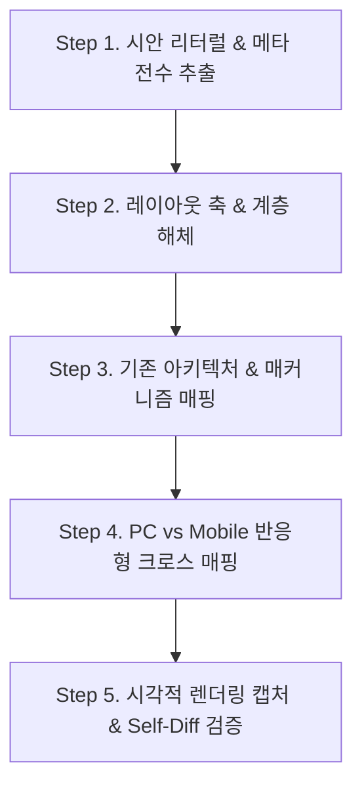

# 📐 디자인 시안 분석 및 퍼블리싱 실무 프로세스 (Design-to-Code Pipeline)

본 문서는 사용자가 디자인 시안(PC 및 Mobile 이미지)을 제공했을 때, AI 어시스턴트 및 작업자가 **원론적인 "1:1 매칭"이라는 추상적 구호에 머무르지 않고, 실제로 무엇을 파악하고 무엇을 놓치면 안 되는지**를 정의한 표준 실무 프로세스 가이드입니다.

---

## ⚠️ 1. 왜 "원론적인 1:1 매칭" 지시만으로는 실패하는가? (The Failure Traps)

LLM 및 개발자가 시안을 보고 작업할 때 흔히 저지르는 **4대 치명적 함정**:

1. **패턴 추론의 함정 (Pattern Assumption)**:
   * "기능 소개 섹션이니까 좌측에 타이틀, 우측에 이미지를 넣으면 되겠지"라며 자신이 학습한 전형적인 템플릿으로 지레짐작함.
   * 실제 시안은 **타이틀과 설명문이 상단 중앙에 전폭 배치**되어 있고, 그 아래에 **[테이블 50% + 이미지 50%]**가 나란히 들어가는 구조임에도 이를 놓침.
2. **텍스트 리터럴 날조 (Text Hallucination)**:
   * 시안의 실제 글자를 확인하지 않고 통상적인 문구로 자동 완성함.
   * (예: 시안 버튼에 `구매 지원 / 시연`이라고 적혀 있는데 `무료 체험 시작`으로 작성, 테이블 헤더가 `비식별 방식`인데 `객체 크기`로 작성).
3. **아키텍처 파괴 또는 무리한 우겨넣기 (Architecture Mismatch)**:
   * 시안을 구현하겠다고 공통 컴포넌트(`BasicSection`, `HeroSection`, `CtaSection`)를 무시하고 날코딩 `div`를 남발하거나,
   * 반대로 `BasicSection layout="horizontal"` 속성에 억지로 테이블을 `headerExtra`에 밀어 넣어 타이틀이 좌측에 갇히는 기형적 레이아웃을 만듦.
4. **반응형 상호 검증 누락 (Breakpoint Blindspot)**:
   * PC 시안만 보고 구현하거나, 모바일 시안에서 **"나란히 유지되어야 하는 요소"**(예: 가상 얼굴 비포/애프터, 트래킹 이미지 내 컨트롤 패널)를 무지성으로 상하 스택(`column`)시켜 깨뜨림.
5. **섹션 배경색 교차 패턴 실명 (Background Color Blindspot)**:
   * 순수 흰색(`#ffffff`)과 라이트 그레이(`#f1f3f4` / `#f8f9fa`)의 미세한 명도 차이(3~4%)를 LLM 비전 모델이 눈대중으로 보다가 '둘 다 밝은 배경'으로 뭉뚱그려 모두 흰색으로 칠해버림.
   * 섹션마다 흰색인지 회색인지 명시적으로 스포이드 추출하지 않아 리듬감 있는 교차 배경이 완전히 파괴됨.

---

## 🛠️ 2. 실전 디자인 분석 및 구현 5단계 파이프라인 (5-Step Execution Pipeline)



---

### Step 1. 시안 리터럴 & 메타 전수 추출 (Literal & Metadata Scan)
시안 이미지를 받으면 가장 먼저 **모든 텍스트와 UI 상태값을 문자 그대로(Verbatim) 적출**합니다. 추론이나 보정은 절대 금지됩니다.

*   [ ] **헤더 텍스트 1:1 추출**:
    *   Eyebrow (영문 대소문자 표기 그대로, 예: `DETECTION & TRACKING`, `WHY XPRIVACY`)
    *   Title (한글 띄어쓰기, 시안의 줄바꿈 `<br />` 위치 그대로)
    *   Description (줄바꿈 및 문장 부호 그대로)
*   [ ] **버튼 및 액션 라벨 추출**:
    *   버튼 텍스트 (예: `구매 지원 / 시연`, `도입 문의`)
    *   버튼 형태 (배경 채움 `Solid` vs 외곽선 `Outline` vs 텍스트 링크)
*   [ ] **테이블 / 데이터 셀 전수 확인**:
    *   표 헤더 컬럼명 (예: `비식별 방식 | 얼굴 | 전신 | 번호판` vs `항목 | 처리 속도 | 1080p FPS 현황`)
    *   셀 상태 표현 (블루 체크 아이콘 `✓` vs 그레이 대시 `-` vs 수치 `약 120 fps`)
*   [ ] **컨트롤 / 상태 UI 확인**:
    *   인디케이터: 라디오 버튼 On/Off 상태, 체크박스 상태
    *   색상 코드 매핑: 시안의 액티브 블루 컬러(`var(--color-primary)` 등)
    *   배지/넘버링: `01`, `02`, `03` 형태가 필(Pill) 박스인지, 심플 텍스트인지 식별

---

### Step 2. 레이아웃 축(Axis) 해체 및 섹션 배경색 판별 (Structural Axis & Background Scan)
섹션마다 Header와 Content의 배치 축 및 **섹션 바닥 배경색(White vs Gray)**을 정확히 분석합니다.

1. **Header와 Content의 배치 축 판단**:
   * **`Vertical 축 (상하 분할)`**:
     * 헤더(타이틀+설명문)가 화면 상단에 위치하고, 그 아래에 본문 컨텐츠가 전폭으로 펼쳐지는가? (중앙 정렬 또는 좌측 정렬)
     * ⚠️ 본문 내부에 [좌 50% + 우 50%] 분할이 있더라도, 타이틀이 상단에 있다면 **섹션 레벨에서는 반드시 Vertical**입니다!
   * **`Horizontal 축 (좌우 분할)`**:
     * 타이틀/설명문 자체가 좌측 40~50% 영역에 있고, 우측 50~60% 영역에 비주얼/컨텐츠가 배치되는가?
   * **`Split Header (헤더 내부 분할)`**:
     * 히어로 섹션처럼 타이틀은 좌측 끝, 설명문은 우측 끝에 수평 정렬되는가?
2. **섹션 배경색(White vs Gray) 스포이드 전수 판별**:
   * ⚠️ **배경색 누락 방지 필수 규칙**:
     * 각 섹션의 좌/우 외부 여백 픽셀을 스포이드로 확인하여 **순수 흰색(`bg="white"`, `#ffffff`)**인지, **라이트 그레이(`bg="gray"`, `#f1f3f4` / `var(--color-gray-100)`)**인지 전수 판별합니다.
     * 섹션 내부 카드가 흰색이더라도, 섹션 바닥 배경이 회색인 경우가 많으므로 반드시 바닥 배경을 확인해야 합니다.
3. **Content 내부 그리드 구조 판단**:
   * 본문 영역이 1열인가?
   * 2단 분할(테이블 + 비주얼 사진)인가?
   * 3열 카드 리스트(`01, 02, 03`)인가?
   * 오버레이(Absolute Layer): 비주얼 위에 올라간 다크 패널, 바운딩 박스, 태그 존재 여부.

---

### Step 3. 기존 아키텍처 & 매커니즘 매핑 (Architecture Mapping)
새로운 HTML 태그나 컴포넌트를 무분별하게 생성하지 않고, **프로젝트에 이미 설계된 코어/도메인 컴포넌트 메커니즘**과 1:1로 결합합니다.

*   **컴포넌트 선택 기준**:
    *   상단 글로벌 Hero: `<HeroSection>` 사용
    *   일반 본문 섹션: `<BasicSection bg="white" | "gray">` 사용
    *   하단 CTA 배너: `<ProductCta>` (또는 `<CtaSection>`) 사용
*   **컴포넌트 속성 매핑 규칙**:
    *   배경색: `<BasicSection bg="white">` 또는 `<BasicSection bg="gray">` 명시
    *   타이틀이 상단 중앙에 위치하고 본문이 2분할인 경우:
        *   ❌ `BasicSection layout="horizontal"`에 `headerExtra`로 테이블을 넣지 말 것 (타이틀이 좌측에 갇힘).
        *   ⭕ `<BasicSection layout="vertical" align="center" bg="...">`로 헤더를 상단에 배치하고, `children` 내부에 `.splitContentWrap` 플렉스 컨테이너를 두어 [테이블 + 이미지]를 2열 배치할 것.
    *   타이틀이 좌측 열에 위치하고 우측에 디바이스 프레임이 있는 경우:
        *   ⭕ `<BasicSection layout="horizontal" bg="..." headerExtra={...}>` 활용.
*   **디자인 토큰 엄격 준수**:
    *   폰트: `var(--font-family-base)` (Pretendard), `var(--font-family-mono)` (데이터/코드)
    *   컬러: `var(--color-primary)`, `var(--color-gray-*)`, `var(--color-white)`
    *   단위: 모든 간격, 크기, 폰트는 `rem` 단위 (`1rem = 1px`) 사용. 모바일 뷰포트 높이는 `svh` 사용.

---

### Step 4. PC vs Mobile 반응형 크로스 매핑 (Responsive Cross-Mapping)
PC 시안과 Mobile 시안을 나란히 두고 **뷰포트 축소 시 무엇이 변하고 무엇이 유지되는지**를 대조표로 작성합니다.

| 검증 요소 | 데스크탑 (1024px 초과) | 모바일 (768px 이하) | 반응형 구현 주의사항 |
|:---|:---|:---|:---|
| **헤더 배치** | 좌우 분할 또는 전폭 중앙 | 상하 스택(`column`), 좌측 정렬 | `text-align`, `flex-direction` 분기 |
| **타이포그래피** | 대형 폰트 (36~44rem) | 모바일 최적 폰트 (24~28rem) | 줄바꿈 `<br />` 모바일 최적화 |
| **본문 그리드** | 2열/3열 가로 배치 | 기본 1열 스택 (`column`) | `.splitContentWrap` 세로 정렬 |
| **디바이스/비교 UI** | 나란히 비교 (`row`) | **나란히 비교 유지 (`row`)** ⚠️ | 모바일에서도 가로 대조가 필수적인 UI(비포/애프터 등)는 강제 세로 변환 금지! |
| **플로팅 컨트롤** | 우측 고정 플로팅 | 비주얼 내 최적 비율 유지 | 텍스트/라디오 크기 스케일다운(`11rem` 등) |

---

### Step 5. 시각적 렌더링 캡처 & Self-Diff 검증 (Visual Capture & Self-Diff)
코딩 완료 후 말로만 끝내지 않고, **실제 브라우저 렌더링 스크린샷을 캡처하여 원본 시안과 1:1로 비교**합니다.

1. **자동 검사 실행**:
   ```bash
   npm run audit
   ```
   * TypeScript 타입 에러 0건 및 아키텍처 규칙 통과 확인.
2. **실제 브라우저 스크린샷 캡처**:
   * 데스크탑 (1440px) 풀페이지 캡처
   * 모바일 (375px) 풀페이지 캡처
3. **6대 필수 Self-Diff 체크리스트**:
   * [ ] **1. 텍스트 완전성**: 원본 시안에 있는 단어 중 누락되거나 임의로 바뀐 문구가 없는가?
   * [ ] **2. 배치 축 일치**: 헤더와 본문, 본문 내부 좌우 배치가 시안과 정확히 같은 방향인가?
   * [ ] **3. 섹션 배경색(White vs Gray) 일치**: 시안의 각 섹션 바닥 배경(흰색 vs 연회색 교차)이 실제 렌더링 화면과 100% 동일한가?
   * [ ] **4. 컴포넌트 룩앤필**: 박스 라운드값(`border-radius`), 그림자(`shadow`), 카드 배경색이 일치하는가?
   * [ ] **5. 인터랙션 상태 표기**: 라디오/체크박스의 선택된 아이템과 선택 안 된 아이템의 시각적 형태가 시안과 동일한가?
   * [ ] **6. 모바일 안전성**: 모바일 뷰포트에서 잘려 나가거나 레이아웃이 깨진 영역이 없는가?

---

## 📌 3. 실전 요약 체크카드 (Cheat Sheet)

> **"시안을 받으면 눈대중으로 대충 코딩하지 마라."**
> 1. 글자부터 하나도 빠짐없이 긁어모아라 (`Step 1`)
> 2. 타이틀 축과 **섹션별 흰색/회색 바닥 배경**을 스포이드로 찍어라 (`Step 2`)
> 3. 이미 있는 `BasicSection bg="white"|"gray"`에 어떻게 앉힐지 설계하라 (`Step 3`)
> 4. 모바일 시안에서 세로로 갈 놈과 가로로 남을 놈을 구분하라 (`Step 4`)
> 5. 스크린샷을 직접 찍어서 시안과 1:1로 대조하고 끝내라 (`Step 5`)
